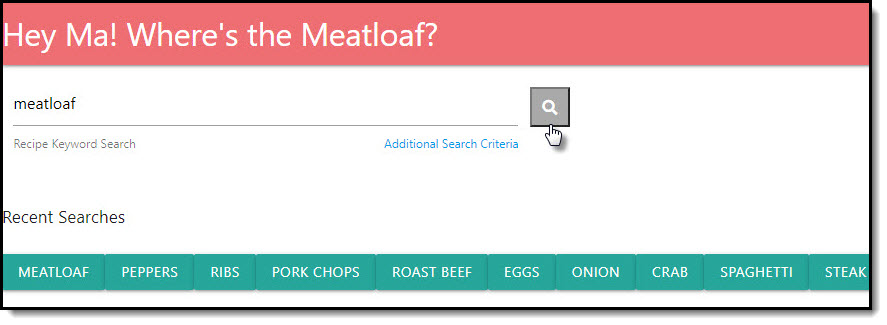
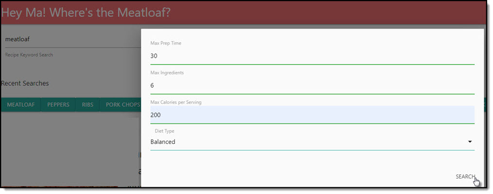
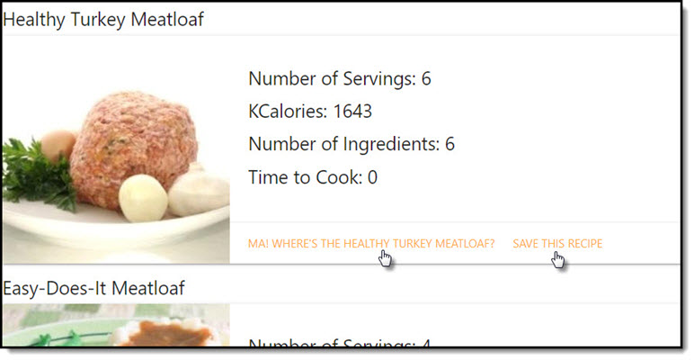
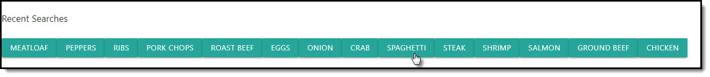
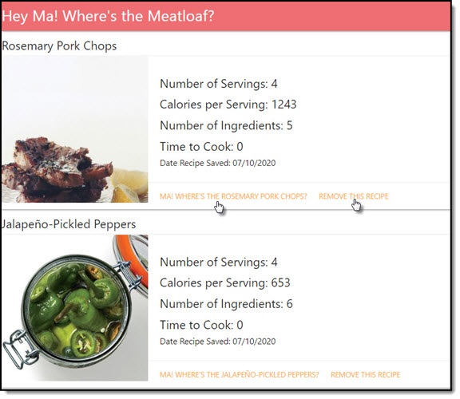

# where-is-the-meatloaf

Hey Ma! Where's the Meatloaf? was created as a tool for people who are too busy to think of healthy meals to eat on a daily/weekly basis and too busy to keep track of their calorie intake.

## Application

Use this link to access this application 
https://harveyb4b.github.io/where-is-the-meatloaf/

Use this link to access the repository 
https://github.com/harveyb4b/where-is-the-meatloaf

## Usage

This project is useful because it has a clean and simple design and returns excellent recipes  when a user searches by recipe name.

You have the ability to select additional criteria 

You can use the links to view the recipe and/or save it for later.

Your recent searches are saved as quick click bottons. Clicking any of these buttons will immediately  return.

Access your saved recipes using the "Saved Recipes" link where you can view the recipe or clear it from your saved recipes.

## Authors 
Presented by Team “Do You Want Fries With That?”
•Christina Bayley
•Brian Harvey
•Michel Pierre-Gilles

